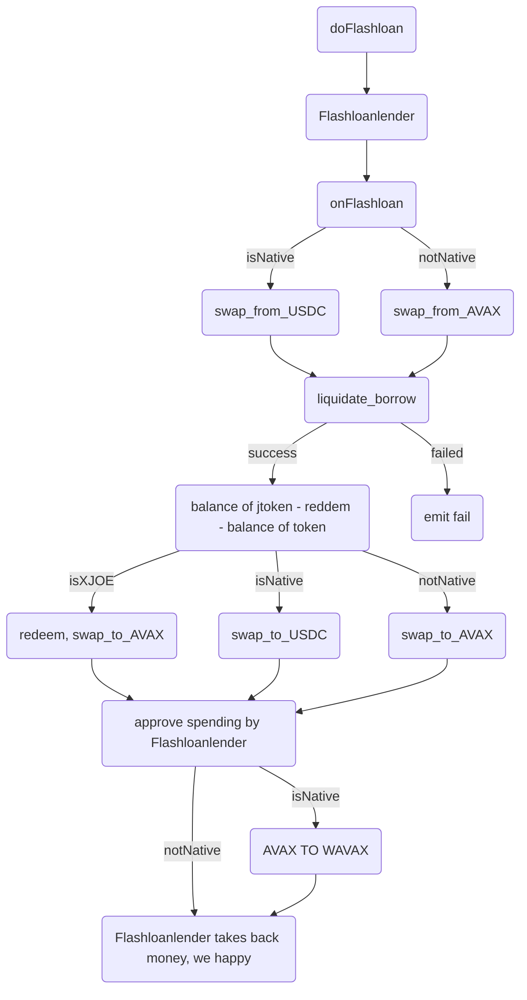
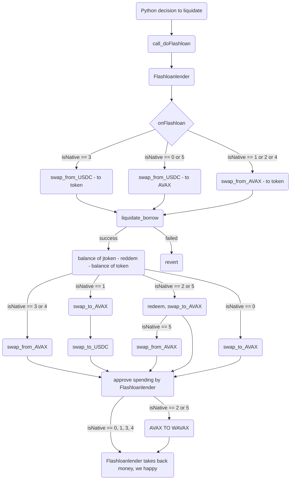

<div id="top"></div>
<!--
*** kudos to https://github.com/othneildrew/Best-README-Template/blob/master/BLANK_README.md for this template
-->


<!-- PROJECT LOGO -->
<br />
<div align="center">
  <a href="https://github.com/pecio222/TJ_liquidation_development">
  </a>

<h3 align="center">Liquidation Bot using Flash Loans</h3>

  <p align="center">
    My humble take on Liquidation Bot for Trader's Joe lending  
    <br />
    <a href="https://github.com/pecio222/TJ_liquidation_development"><strong>Explore the docs »</strong></a>
    <br />
    <br />
    <a href="https://github.com/pecio222/TJ_liquidation_development/issues">Report Bug</a>
    ·
    <a href="https://github.com/pecio222/TJ_liquidation_development/issues">Request Feature</a>
  </p>
</div>


<!-- TABLE OF CONTENTS -->
<summary>Table of Contents</summary>
  <ol>
    <li>
      <a href="#about-the-project">About The Project</a>
      <ul>
        <li><a href="#built-with">Built With</a></li>
      </ul>
    </li>
    <li>
      <a href="#getting-started">Getting Started</a>
      <ul>
        <li><a href="#disclaimer">DISCLAIMER</a></li>
        <li><a href="#prerequisites">Prerequisites</a></li>
        <li><a href="#installation">Installation</a></li>
      </ul>
    </li>
    <li><a href="#tests">Tests</a></li>
    <li><a href="#flowcharts">Flowcharts</a></li>
    <li><a href="#roadmap">Roadmap</a></li>
    <li><a href="#contributing">Contributing</a></li>
    <li><a href="#license">License</a></li>
    <li><a href="#contact">Contact</a></li>
  </ol>


<!-- ABOUT THE PROJECT -->
## About The Project

Hello!

Nice to welcome you to my first "big" coding project.
It was fun. Exhausting, long, full of doubts, but fun :)

In this repo you can find working solution. Not competitive, not fast, not safe, with issues, but.. working.

As for now, repository is set to private. Probably will make it open after bounty resolution, but feel free to share anyway.


<p align="right">(<a href="#top">back to top</a>)</p>


### Built With

* [Brownie](https://eth-brownie.readthedocs.io/)
* [web3.py](https://web3py.readthedocs.io/en/stable/)
* [Pytest](https://docs.pytest.org/en/7.1.x/)
* [OpenZeppelin - Ownable](https://github.com/OpenZeppelin/openzeppelin-contracts/blob/master/contracts/access/Ownable.sol)
* youtube&discord,
* and a lot, lot of trial and error.

<p align="right">(<a href="#top">back to top</a>)</p>


<!-- GETTING STARTED -->

## DISCLAIMER

This project is not audited, and in fact developed for learning purposes only. Please don't risk any real funds with these contracts or Python scripts.

To achieve potential profits you need to be much, much more advanced and faster.


## Getting Started

This is an example of how you may give instructions on setting up your project locally.
To get a local copy up and running follow these simple example steps.


### Installation

1. Clone the repo
   ```sh
   git clone https://github.com/pecio222/TJ_liquidation_development.git
   ```
2. Install dependencies
   ```sh
   pip3 install -r requirements.txt
   ```
3. Enter your Private Keys in `.env`. Remember to be cautious with real funds! Forking mainnet is fun.
   ```
   export PRIVATE_KEY="0xasdfasdfasdfasd..."
   ```
4. Run into the wild (not recommended with real funds)
   ```
   brownie run scripts/main.py
   ```

5. Or, better, just run tests:
   ```
   brownie console --network avax-main-fork
   brownie test
   ```
Be cautious - go to 'tests' below for more insight.


<p align="right">(<a href="#top">back to top</a>)</p>


## Tests
There are 4 test files:
1. ***internal_unit_test.py***- testing all internal functions of FlashloanBorrowerDev.sol, through inheriting to FlashloanExposed.sol (not tested at all, just helper contract, which absolutely destroys code coverage stats, but what can I do?)

2. ***external_unit_test.py*** - testing all functions available from outside of contract

3. ***failed_liquidation_test.py*** - testing failed liquidation - liquidate_borrow function returns failure code, event is emmited and transaction is reverted with comment *"liquidation failed"*. Setup similiar to number 4, but we testing failure here.

4. ***full_integration_test.py*** - testing complete, working solution with configurable inputs.

Test files 1-3 are pretty straightforward. Feel free to check code and comments provided there, if above explainations are not enough.

How does ***full_integration_test*** work?

1. Setup contract + web3 provider
2. Choose tokens to supply & borrow & than liquidate in fixture between lines 40-48. Feel free to add any combination.
There are possible combinations, that will never go underwater (supplying tokens with higher % interest than borrowed - so be cautious, this will invoke "account is not underwater" assertion)
3. "test_underwater_setup" - swap free avax to requested token ->  supply max amount of requested token, borrow max possible amount -> wait 100 days, acccure interest. You will be underwater and ready to be liquidated
4. "test_flashloan_liquidation_full" - do what real-life solution would do, so liquidate account that we just pushed underwater. Perfect :)

I suppose, that above procedure proves, that solution is correct and working.


Above grants test coverage of 97.5% as below, but still doesn't guarantee 100% safety and working in all environments, but gives some hope at least.
```
  contract: FlashloanBorrowerDev - 97.5%
    FlashloanBorrowerDev.doFlashloan - 100.0%
    FlashloanBorrowerDev.liquidate_borrow - 100.0%
    FlashloanBorrowerDev.onFlashLoan - 100.0%
    Ownable.transferOwnership - 75.0%
```

To be honest - I have no idea what I'm missing with transferOwnership. That said, feeling confident, that OpenZeppelin contracts are safe.


<p align="right">(<a href="#top">back to top</a>)</p>

<!-- FLOWCHARTS -->
## Flowcharts

Graphical visualisation of provided Solidity code.
Feel free to use comments inside code also.

1. Less complicated and less detailed flowchart of FlashloanBorrowerDev.sol:




2. Full flowchart of FlashloanBorrowerDev.sol:




<p align="right">(<a href="#top">back to top</a>)</p>


<!-- ROADMAP -->
## Roadmap

- False-positives filtering:
    - need to implement solution, so that my liquidator doesn't fire too fast. Subgraph provides accounts with <1 health, that are not profitable (gas costs?), or even not possible to liquidate.
- Optimizing for speed:
    - Exisiting bots liquidate on the same block. Using subgraph is probably too slow (maybe using health < 1.01 for first filtering would be enough?)
- Optimizing for math:
    - Right now there is few % margin of liquidation amounts - should be more precise
- Cleaning code
    - Time goes by fast; code does not look like i wanted it to, should put few more days polishing existing features.
- Analyzing existing bots
    - Analyze how fast they are. As far as i've seen, there is 1 bot dominating space, but didn't research enough to judge more.
- Notifications/logging
    - No idea why my previously-working-solutions-from-other-places decided to die today and stop collaboration. Easy to fix, probably.


See the [open issues](https://github.com/pecio222/TJ_liquidation_development/issues) for a full list of proposed features (and known issues).

<p align="right">(<a href="#top">back to top</a>)</p>


<!-- CONTRIBUTING -->
## Contributing

Contributions are what make the open source community such an amazing place to learn, inspire, and create. Any contributions you make are **greatly appreciated**.

If you have a suggestion that would make this better, please fork the repo and create a pull request. You can also simply open an issue with the tag "enhancement".
Don't forget to give the project a star! Thanks again!

1. Fork the Project
2. Create your Feature Branch (`git checkout -b feature/AmazingFeature`)
3. Commit your Changes (`git commit -m 'Add some AmazingFeature'`)
4. Push to the Branch (`git push origin feature/AmazingFeature`)
5. Open a Pull Request

<p align="right">(<a href="#top">back to top</a>)</p>


<!-- LICENSE -->
## License

Distributed under the MIT License.

Do what you want. If you find this useful, DM me. Would be happy to help.


<p align="right">(<a href="#top">back to top</a>)</p>


<!-- CONTACT -->
## Contact


[Twitter - pecio222](https://twitter.com/pecio222)

[Discord - pecio33#5843](https://discord.com/users/pecio33#5843/)

Project Link: [https://github.com/pecio222/TJ_liquidation_development](https://github.com/pecio222/TJ_liquidation_development)

If you want to talk about this repo, DM me, would be happy to know fellow wanna-be coder.

You think I'm competent enough, that I will execute any working solution for you? I'm probably not, but DM me anyway :)

<p align="right">(<a href="#top">back to top</a>)</p>


