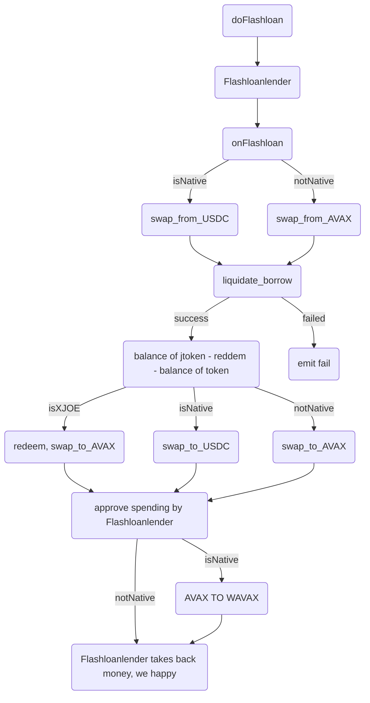

TBD

UNDER DEVELOPMENT

FlashloanBorrower.sol flowchart:

```mermaid
graph TD;
    A(doFlashloan)-->B(Flashloanlender);
    B-->C(onFlashloan);
    C-->|notNative|D(swap_from_AVAX);
    C-->|isNative|D1(swap_from_USDC);
    D1-->E
    D-->E(liquidate_borrow);
    E-->|success|F(balance of jtoken - reddem - balance of token)
    E-->|failed|F2(emit fail)
    F-->|isNative|G1(swap_to_USDC)
    F-->|isXJOE|G2(redeem, swap_to_AVAX)
    F-->|notNative|G(swap_to_AVAX)
    G2-->H(approve spending by Flashloanlender) 
    G1-->H(approve spending by Flashloanlender)
    G-->H(approve spending by Flashloanlender)
    
    H-->|isNative|I(AVAX TO WAVAX)
    H-->|notNative|J
    I-->J(Flashloanlender takes back money, we happy)
```

Should be private for now - if you found it, please let me know - first time using github