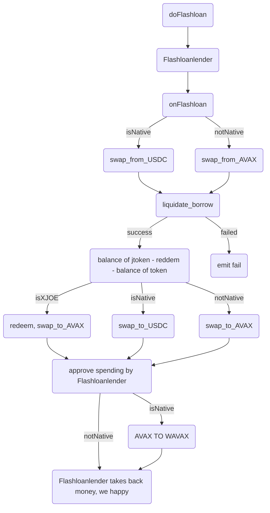
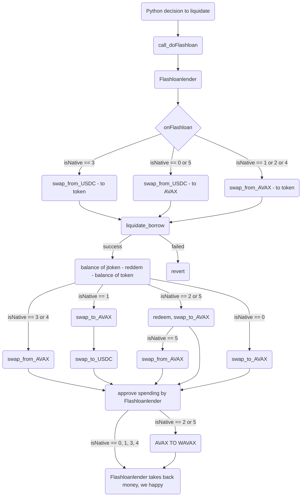

Introduction
Tests

FlashloanBorrower.sol flowchart:

Less complicated and less detailed flowchart of FlashloanBorrowerDev.sol:

Full flowchart of FlashloanBorrowerDev.sol:

Should be private for now - if you found it, please let me know - first time using github